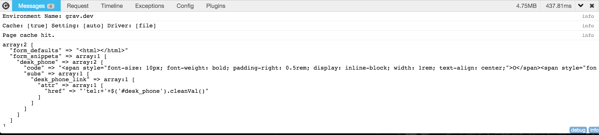

# Grav Import Plugin

This plugin allows importing of user-defined YAML files to facilitate custom actions/settings.

There are no dependancies

# Installation

Installing the Import plugin can be done in one of two ways. Using the GPM (Grav Package Manager), manual installation via a zip file.

## GPM Installation (Preferred)

The simplest way to install this plugin is via the [Grav Package Manager (GPM)](http://learn.getgrav.org/advanced/grav-gpm) through your system's Terminal (also called the command line). From the root of your Grav install type:

    $ bin/gpm install import

This will install the Import plugin into your `/user/plugins` directory within Grav. Its files can be found under `/your/site/grav/user/plugins/import`.

## Manual Installation

To manually install this plugin, just download the zip version of this repository and unzip it under `/your/site/grav/user/plugins`. Then, rename the folder to `import`. You can find these files either on [GitHub](https://github.com/Deester4x4jr/grav-plugin-import) or via [GetGrav.org](http://getgrav.org/downloads/plugins).

You should now have all the plugin files under

    /your/site/grav/user/plugins/import

# Configuration

There are currently no settings to configure for this plugin.  In the future, user settings may become available.  If so, `import` will allow you to use the Grav Admin Plugin to adjust these settings as needed.

# Usage

To use `import`, you will need to trigger the plugin by adding an `imports:` declaration in the header of the page you need to load the YAML file(s) for:

#### Single YAML file
```
---
title: 'Some Page'
imports: 'file.yaml'
---

# {{ page.title }}
```

#### Array of YAML files
```
---
title: 'Some Page'
imports:
    - 'file.yaml'
    - 'file2.yaml'
---

# {{ page.title }}
```

`import` will parse these YAML files and inject the contents into the page header as an array.  To see the output, [Enable the Debug Bar](http://learn.getgrav.org/advanced/debugging#debug-bar) and execute `{{ dump(header.imports) }}` somewhere in your twig template, and you should see something like the following:




The contents of these files is up to you, and you will need to determine how you are going to utilize them in your code.  The goal is to make the data in the YAML files available to themes and plugins to expand the functionality of Grav in an open-ended fashion.

# Updating

As development for the Import plugin continues, new versions may become available that add additional features and functionality, improve compatibility with newer Grav releases, and generally provide a better user experience. Updating Import is easy, and can be done through Grav's GPM system, as well as manually.

## GPM Update (Preferred)

The simplest way to update this plugin is via the [Grav Package Manager (GPM)](http://learn.getgrav.org/advanced/grav-gpm). You can do this with this by navigating to the root directory of your Grav install using your system's Terminal (also called command line) and typing the following:

    bin/gpm update import

This command will check your Grav install to see if your GitHub plugin is due for an update. If a newer release is found, you will be asked whether or not you wish to update. To continue, type `y` and hit enter. The plugin will automatically update and clear Grav's cache.

## Manual Update

Manually updating Import is pretty simple. Here is what you will need to do to get this done:

* Delete the `your/site/user/plugins/import` directory.
* Download the new version of the Import plugin from either [GitHub](https://github.com/Deester4x4jr/grav-plugin-import) or [GetGrav.org](http://getgrav.org/downloads/plugins).
* Unzip the zip file in `your/site/user/plugins` and rename the resulting folder to `import`.
* Clear the Grav cache. The simplest way to do this is by going to the root Grav directory in terminal and typing `bin/grav clear-cache`.

> Note: Any changes you have made to any of the files listed under this directory will also be removed and replaced by the new set. Any files located elsewhere (for example a YAML settings file placed in `user/config/plugins`) will remain intact.